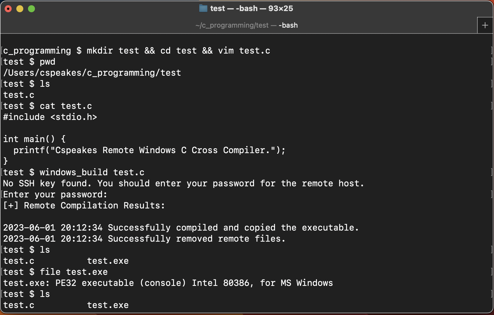

# Remote C Windows Host Compiler

This script is designed to compile C code on a remote Windows host. It copies the source code from the local machine to the remote host, compiles it using GCC, then copies the resulting executable back to the local machine. The script also cleans up after itself by removing the source and executable files from the remote host upon successful completion.

## Prerequisites

- The local system needs to have `bash`, `scp`, `ssh`, and `sshpass` installed and in the system PATH.
- The remote Windows host needs to have a compatible SSH and SCP server running (such as OpenSSH) and `gcc` installed.
- You should have SSH access to the Windows machine.

## Installation

1. Save the script to a file, for example `remote_compiler.sh`, in `/usr/local/bin` directory to make it accessible from any directory:

	```bash
	sudo mv windows_build /usr/local/bin/
	```

2. Make the script executable:

	```bash
	sudo chmod +x /usr/local/bin/windows_build
	```

Now you can run `windows_build` from any directory on your system.

## Usage

1. Make sure you have `bash`, `scp`, `ssh`, and `sshpass` installed on your local machine.

2. Ensure that `gcc` is installed on the Windows machine and that you have SSH access to that machine.

3. Run the script with the source file as an argument:

	```bash
	windows_build source_file.c
	```

	Replace `source_file.c` with the path to the source file you want to compile.

	

4. If you haven't already, you will be prompted to enter the remote Windows build user and host. You can set these permanently by adding the following commands into your local MacOS user .profile file:

	```bash
	export WINDOWS_BUILD_USER=your_username
	export WINDOWS_BUILD_HOST=your_host
	```

	Replace `your_username` with your username and `your_host` with the host name or IP address of the Windows machine and then be sure to source the .profile file again to update your local environment. 

	```bash
	source ~/.profile
	```

5. If no SSH key is found, you will be prompted to enter your password for the remote host. 

Upon successful execution, the script will compile the source code on the remote host and copy the resulting executable back to the local machine.

**Please remember to test this script in a controlled environment before using it in a production setting.**

## Known Limitations

- The script assumes that the user has the necessary permissions to delete files in the specified directories on the remote Windows host.
- It does not handle cases where the files do not exist on the remote host when the deletion attempt is made.
